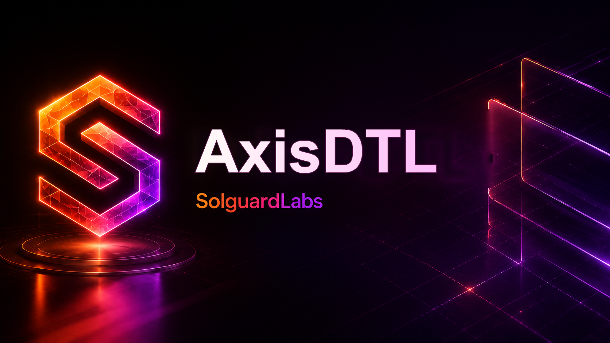

# AxisDTL



AxisDTL es una DTL desarrollada en Rust para modelar un protocolo de liquidacion
multi-activo con ejecucion RFQ, rutas compuestas, custodia de reservas y
controles de riesgo. El binario expone escenarios reproducibles que serializan
el estado resultante en JSON para facilitar revision, automatizacion y
validacion por herramientas externas.

El proyecto esta estructurado como una aplicacion ejecutable, no como una
libreria. La logica principal vive en `src/` y se organiza en modulos de dominio
para mantener separadas las responsabilidades principales del protocolo.

## Componentes

- `amount`: tipos de importe y basis points con aritmetica comprobada.
- `codec`: serializacion canonica usada para digests y firmas.
- `crypto`: identidades Ed25519, claves de prueba y verificacion de firmas.
- `ids`: identificadores deterministas para cuentas, activos, ordenes,
  transacciones y digests.
- `market`: activos, cotizaciones de ejecucion, ordenes de swap y solicitudes
  de liquidacion.
- `ledger`: estado contable, balances, diario de eventos, nonces, conservacion
  de suministro y ejecucion atomica.
- `oracle`: observaciones de precio, publicadores autorizados y validacion de
  bandas de mercado.
- `routing`: venues, route book, tramos de ruta y evaluacion de calidad.
- `policy`: limites de protocolo, perfiles de cuenta y motor de riesgo.
- `custody`: vaults, politica de tesoreria, reservas y cuentas de margen.
- `runtime`: escenarios CLI y reportes JSON.

## Flujo de Liquidacion

1. Se registra el catalogo de activos y cuentas operativas.
2. Se inicializan saldos de genesis para participante y pool.
3. Se configuran perfiles de riesgo, publicadores de oraculo, vaults, tesoreria
   y venues.
4. Un solver emite una cotizacion de ejecucion para un par de activos.
5. El pagador firma los terminos de swap vinculados a la cotizacion.
6. El solver firma la solicitud de liquidacion observando el digest de la
   cotizacion.
7. El ledger valida nonces, firmas, rutas, precio, limites de riesgo,
   disponibilidad y conservacion contable.
8. La ejecucion se aplica de forma atomica y queda reflejada en el journal.

## Escenarios CLI

El binario acepta un escenario opcional:

```bash
cargo run --quiet -- routed
cargo run --quiet -- direct
cargo run --quiet -- batch
cargo run --quiet -- auction
cargo run --quiet -- snapshot
```

Si no se pasa argumento, se ejecuta `routed`.

Cada escenario devuelve un reporte JSON con:

- activos fuente y destino;
- IDs de ordenes y transacciones;
- balances relevantes;
- suministro agregado por activo;
- superficie configurada de venues, rutas, vaults y margenes;
- numero de entradas del journal;
- digest final de estado;
- resultado de conservacion.

## Requisitos

- Rust `1.96` o superior.
- Node.js `20` o superior para la suite JavaScript.
- Bash para los scripts de CI locales.

## Comandos

Formato:

```bash
cargo fmt --all -- --check
```

Compilacion:

```bash
cargo check --locked
```

Tests Rust:

```bash
cargo test --locked
```

Tests Node:

```bash
node --test tests/node/*.test.js
```

Suite completa:

```bash
bash scripts/ci.sh
```

En entornos Windows donde Bash no herede las rutas de Rust o Node, los comandos
pueden ejecutarse directamente desde PowerShell usando los mismos argumentos.

## Pruebas

La suite de Rust valida la salida del binario y los invariantes principales de
los escenarios. La suite de Node valida la compatibilidad del JSON emitido por
CLI para consumidores externos.

Cobertura funcional actual:

- ejecucion `routed` por defecto;
- liquidacion directa;
- batch con dos ordenes;
- ruta compuesta tipo auction;
- snapshot de configuracion;
- conservacion de saldos y unicidad de identificadores.

## CI

El workflow de GitHub Actions ejecuta:

1. checkout del repositorio;
2. instalacion de Rust con `rustfmt`;
3. cache de build Rust;
4. instalacion de Node.js 24;
5. `bash scripts/ci.sh`.

Dependabot esta configurado para revisar dependencias de Cargo, npm y GitHub
Actions semanalmente.

## Estado del Proyecto

AxisDTL es un laboratorio tecnico autocontenido. El estado de protocolo se
genera localmente a partir de fixtures deterministas y no requiere servicios
externos, nodos remotos, bases de datos ni claves reales.
