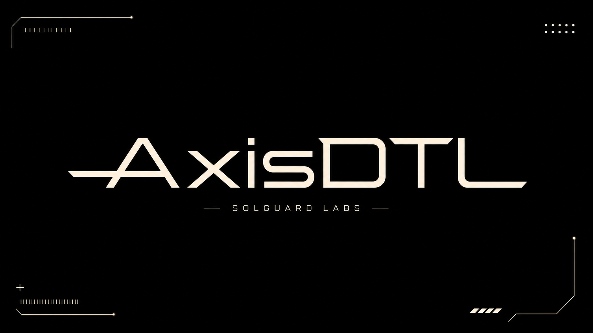
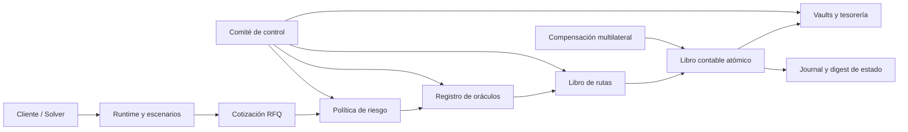
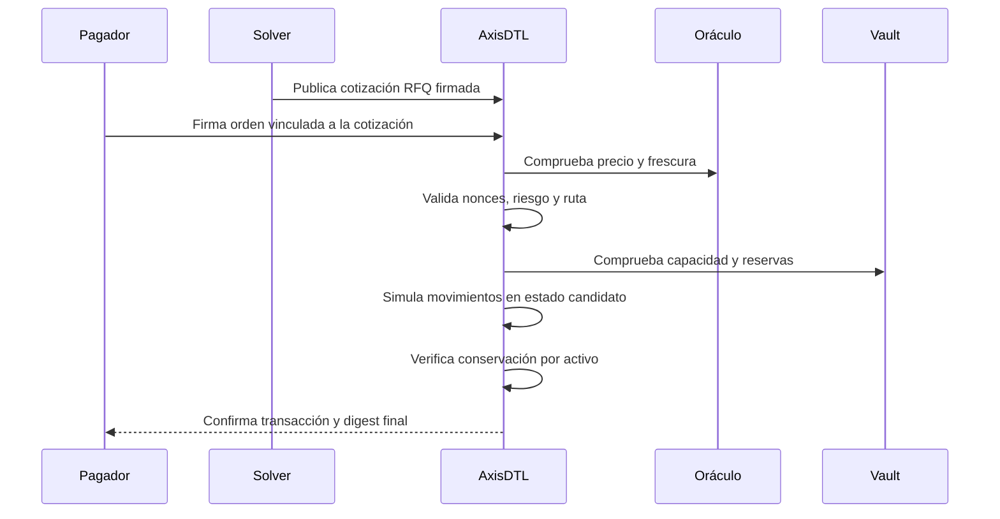
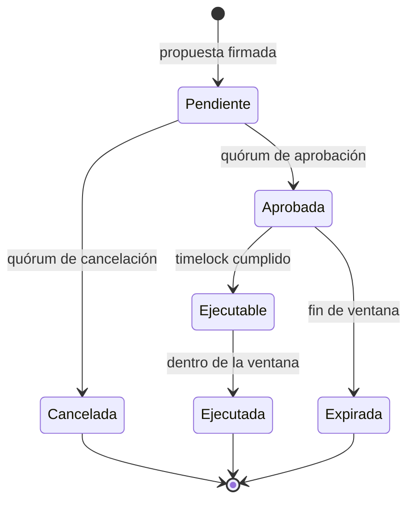

# AxisDTL



AxisDTL es un protocolo de liquidación determinista multi-activo escrito en
Rust. Coordina cotizaciones RFQ, rutas de ejecución, custodia segregada,
compensación multilateral y gobierno con firmas Ed25519 sobre un libro contable
atómico. Su interfaz de escenarios produce estados JSON reproducibles para
operadores, integradores y procesos de verificación.

La versión `1.0.0` establece una superficie operativa completa y autocontenida:
no depende de nodos remotos, servicios de precio externos ni bases de datos para
validar su comportamiento.

## Capacidades

- Libro mayor multi-activo con conservación de suministro por activo.
- Cotizaciones firmadas, nonces monótonos y dominios criptográficos separados.
- Ejecución directa, por lotes y mediante rutas de varios tramos.
- Registro de oráculos con publicadores autorizados, frescura y bandas de precio.
- Motor de riesgo para importes, comisiones, rutas y perfiles de cuenta.
- Vaults, reservas de tesorería y cuentas de margen segregadas.
- Compensación multilateral con posiciones netas, compresión y buffer de reserva.
- Comité de control con quórum, firmas Ed25519, nonces y timelock.
- SDK JavaScript con aritmética `bigint` para integraciones operativas.

## Arquitectura


```mermaid
flowchart LR
    Client["Cliente / Solver"] --> Runtime["Runtime y escenarios"]
    Runtime --> Quote["Cotización RFQ"]
    Quote --> Risk["Política de riesgo"]
    Risk --> Oracle["Registro de oráculos"]
    Oracle --> Routing["Libro de rutas"]
    Routing --> Ledger["Libro contable atómico"]
    Ledger --> Custody["Vaults y tesorería"]
    Ledger --> Journal["Journal y digest de estado"]
    Clearing["Compensación multilateral"] --> Ledger
    Governance["Comité de control"] --> Risk
    Governance --> Oracle
    Governance --> Routing
    Governance --> Custody
```

| Dominio      | Responsabilidad           | Controles principales                    |
| ------------ | ------------------------- | ---------------------------------------- |
| `amount`     | Importes y basis points   | enteros sin signo, overflow comprobado   |
| `codec`      | Representación canónica   | dominios de serialización estables       |
| `crypto`     | Identidad y firma         | Ed25519, coherencia cuenta/clave         |
| `market`     | Activos, RFQ y settlement | vigencia, comisión, identidad, nonces    |
| `oracle`     | Precio de referencia      | autorización, frescura, desviación       |
| `routing`    | Venues y rutas            | continuidad, capacidad, límite de tramos |
| `policy`     | Perfil y límites          | importe, salida, comisión, exposición    |
| `ledger`     | Balances y journal        | ejecución atómica, conservación          |
| `custody`    | Vaults y margen           | segregación, reservas, política          |
| `clearing`   | Netting por ventana       | referencias únicas, buffer, balance neto |
| `governance` | Cambios de control        | quórum, nonce, timelock, expiración      |

La descripción completa se encuentra en
[`docs/arquitectura.md`](./docs/arquitectura.md).

## Flujo de liquidación


```mermaid
sequenceDiagram
    participant P as Pagador
    participant S as Solver
    participant A as AxisDTL
    participant O as Oráculo
    participant V as Vault

    S->>A: Publica cotización RFQ firmada
    P->>A: Firma orden vinculada a la cotización
    A->>O: Comprueba precio y frescura
    A->>A: Valida nonces, riesgo y ruta
    A->>V: Comprueba capacidad y reservas
    A->>A: Simula movimientos en estado candidato
    A->>A: Verifica conservación por activo
    A-->>P: Confirma transacción y digest final
```

El ledger trabaja sobre un estado candidato. Cualquier rechazo de firma, nonce,
oráculo, ruta, riesgo, saldo o conservación descarta el conjunto completo de
cambios.

## Modelo económico

AxisDTL separa el importe bruto negociado, la posición neta y la reserva
operativa. Para un activo `a` y una cuenta `i`:

```text
debit(i,a)  = Σ obligaciones donde i es deudor
credit(i,a) = Σ obligaciones donde i es acreedor
netDebit    = max(debit - credit, 0)
netCredit   = max(credit - debit, 0)
```

La ventana solo es válida cuando la suma de débitos netos coincide con la suma
de créditos netos de cada activo. El requerimiento de reserva incorpora un
buffer configurable:

```text
netPayable      = Σ netDebit(i,a)
compressed      = grossObligations - netPayable
compressionBps  = floor(compressed × 10_000 / grossObligations)
requiredReserve = floor(netPayable × (10_000 + bufferBps) / 10_000)
shortfall       = max(requiredReserve - availableReserve, 0)
```

Ejemplo: un ciclo de obligaciones de `100`, `70` y `40` unidades tiene un bruto
de `210`, un pago neto de `60` y una compresión de `7.142 %`. Con un buffer del
`10 %`, requiere `66` unidades de reserva. Véase
[`docs/modelo-economico.md`](./docs/modelo-economico.md).

## Inicio rápido

### Requisitos

- Rust `1.96` o superior.
- Bun `1.3.14`.
- Node.js `24` para las comprobaciones de compatibilidad.
- Bash o PowerShell 7 para la verificación local.

### Preparación

```bash
bun install --frozen-lockfile
cargo build --locked
```

### Escenarios

```bash
cargo run --quiet -- routed
cargo run --quiet -- direct
cargo run --quiet -- batch
cargo run --quiet -- auction
cargo run --quiet -- snapshot
```

Sin argumento se ejecuta `routed`. Cada escenario devuelve un documento JSON
con identificadores, balances, superficie configurada, journal, digest final y
estado de conservación.

Ejemplo abreviado de `snapshot`:

```json
{
    "scenario": "snapshot",
    "network_id": 42170,
    "surface": {
        "venues": 1,
        "routes": 0,
        "vaults": 1,
        "margins": 1
    },
    "journal_entries": 9,
    "state_digest": "806005234a41a17b44c1f9afca9d30b7018e904b978827483577d9f13a7079a2",
    "conservation_ok": true
}
```

## Uso del SDK

El SDK evita conversiones implícitas a `number` para importes y trabaja con
`bigint` o cadenas decimales enteras.

```js
import { previewNetting, reserveRequirement } from "./sdk/AxisClient.js";

const preview = previewNetting(
    [
        { debtor: "alpha", creditor: "beta", asset: "AXUSD", amount: "100", reference: "r1" },
        { debtor: "beta", creditor: "gamma", asset: "AXUSD", amount: "70", reference: "r2" },
        { debtor: "gamma", creditor: "alpha", asset: "AXUSD", amount: "40", reference: "r3" },
    ],
    { AXUSD: "66" },
    1_000,
);

console.log(preview.fullyReserved); // true
console.log(reserveRequirement("60", 1_000)); // 66n
```

Un adaptador puede enlazar `AxisClient` con el binario, un worker o un servicio
interno siempre que el ejecutor devuelva el JSON del escenario:

```js
import { AxisClient } from "./sdk/AxisClient.js";

const client = new AxisClient(async (args) => runAxisProcess(args));
const health = await client.health();

if (!health.conserved) throw new Error("accounting invariant rejected");
```

Los contratos de integración se detallan en
[`docs/integracion.md`](./docs/integracion.md).

## Gobierno de cambios

Las acciones de control se proponen y votan con payloads canónicos firmados.
Una acción aprobada no se puede ejecutar antes de `earliest_epoch` ni después de
`expires_at_epoch`.


```mermaid
stateDiagram-v2
    [*] --> Pendiente: propuesta firmada
    Pendiente --> Aprobada: quórum de aprobación
    Pendiente --> Cancelada: quórum de cancelación
    Aprobada --> Ejecutable: timelock cumplido
    Ejecutable --> Ejecutada: dentro de la ventana
    Aprobada --> Expirada: fin de ventana
    Cancelada --> [*]
    Ejecutada --> [*]
    Expirada --> [*]
```

Cada revisor tiene un nonce independiente; una firma válida no se puede
reutilizar y un revisor no puede votar dos veces sobre la misma acción. Véase
[`docs/gobierno.md`](./docs/gobierno.md).

## Verificación

Linux, macOS o Git Bash:

```bash
bash scripts/ci.sh
```

PowerShell:

```powershell
.\scripts\ci.ps1
```

La puerta local ejecuta formato, compilación de todos los targets, tests Rust,
Clippy con advertencias denegadas, comprobación JavaScript y verificación de
estructura documental.

Comandos individuales:

```bash
cargo fmt --all -- --check
cargo build --all-targets --locked
cargo test --locked
cargo clippy --all-targets --all-features --locked -- -D warnings
bun run fmt:check
bun run build
bun test --timeout 30000 ./tests/node ./sdk ./scripts
```

## Documentación

- [Arquitectura](./docs/arquitectura.md)
- [Modelo económico](./docs/modelo-economico.md)
- [Modelo de seguridad](./docs/modelo-seguridad.md)
- [Gobierno](./docs/gobierno.md)
- [Operaciones](./docs/operaciones.md)
- [Integración](./docs/integracion.md)
- [Despliegue](./docs/despliegue.md)
- [Política de seguridad](./SECURITY.md)

## Ciclo de versiones

Las versiones de producción usan etiquetas anotadas `vMAJOR.MINOR.PATCH`. La
rama `production`, la rama `main` y el commit resuelto por la etiqueta deben ser
idénticos. El workflow de integridad comprueba además que las versiones de
Cargo y npm coincidan con la etiqueta publicada.

## Licencia

Consulte [LICENSE](./LICENSE).
