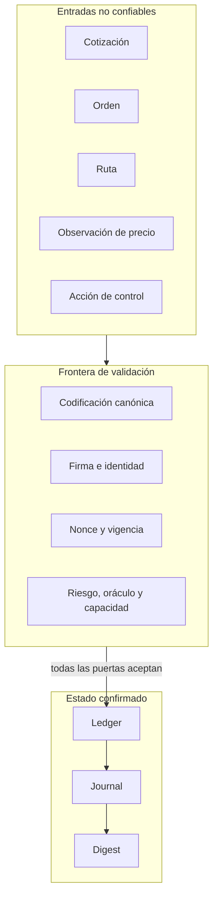
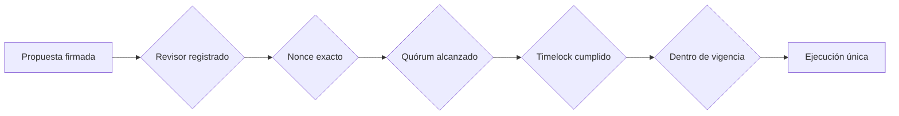

# Política de seguridad de AxisDTL

AxisDTL protege un flujo de liquidación multi-activo mediante controles
criptográficos, contables y operativos independientes. Esta política define el
modelo de confianza, las garantías verificables y el canal responsable para
comunicar un hallazgo de seguridad.

## Versiones mantenidas

| Versión | Estado     | Actualizaciones de seguridad |
| ------- | ---------- | ---------------------------- |
| `1.0.x` | Producción | Sí                           |
| `< 1.0` | Histórica  | No                           |

La referencia operativa es la etiqueta anotada más reciente cuyo commit
coincida con `main` y `production` y cuyos workflows hayan finalizado
correctamente.

## Fronteras de confianza



Ninguna estructura recibida conserva autoridad por el mero hecho de poderse
deserializar. La identidad, el dominio de firma, el nonce, la ventana temporal y
la política aplicable se vuelven a comprobar en el punto de uso.

## Activos protegidos

- Saldos y suministro total de cada activo.
- Autorización de pagadores, solvers, publicadores y revisores.
- Secuencia de nonces por identidad.
- Integridad de cotizaciones, órdenes, rutas y acciones de control.
- Reservas de vaults, tesorería y cuentas de margen.
- Parámetros de riesgo y composición del comité.
- Journal de eventos y digest final del estado.
- Separación entre dominios de activos y ventanas de compensación.

## Adversarios considerados

El modelo contempla participantes que pueden:

- enviar payloads malformados o inconsistentes;
- repetir mensajes firmados previamente;
- modificar un campo después de obtener una firma;
- seleccionar rutas sin continuidad o sin capacidad;
- presentar observaciones antiguas o fuera de banda;
- intentar operar por encima de saldo, reserva o límite;
- coordinar votos insuficientes o ejecutar antes del timelock;
- provocar overflow, división por cero o pérdida de precisión;
- mezclar obligaciones de activos o ventanas diferentes.

No se presupone honestidad del cliente, del solver ni del serializador externo.
Las claves privadas y la seguridad del host que las custodia permanecen fuera
del estado del protocolo.

## Controles criptográficos

### Dominios de firma

Cada familia de mensajes incorpora un dominio estable antes de firmarse. Una
firma de una orden no es válida como voto y una firma de voto no es válida como
propuesta. Los dominios de gobierno vigentes son:

```text
axis-control-action-v1
axis-control-vote-v1
```

El digest sigue conceptualmente:

```text
digest = BLAKE3(domain || canonical_payload)
signature = Ed25519.sign(private_key, digest)
```

La identidad pública se verifica contra el `AccountId` declarado. Los cambios
en campos temporales, nonces o payloads invalidan la verificación.

### Protección contra repetición

Pagadores, solvers y revisores mantienen secuencias independientes. El nonce
recibido debe ser exactamente el esperado; no se aceptan saltos ni valores
anteriores. Los digests ya pendientes, aprobados o ejecutados tampoco se pueden
registrar de nuevo.

## Controles contables

### Atomicidad

Los movimientos se aplican primero sobre una copia candidata del estado. Solo
se publica si se completan todos los débitos, créditos, validaciones y eventos.
Un error intermedio no deja movimientos parciales.

### Conservación

Para cada activo `a`:

```text
expectedSupply(a) = Σ balanceGenesis(i,a)
observedSupply(a) = Σ balanceCurrent(i,a)
accept             = expectedSupply(a) == observedSupply(a)
```

La comprobación se realiza después de las operaciones que alteran balances. El
journal conserva los identificadores deterministas necesarios para reproducir
el resultado.

### Compensación

El motor mantiene cada activo en un dominio independiente, rechaza referencias
duplicadas y exige una única ventana por ciclo. Antes de considerar financiada
una ventana verifica:

```text
Σ netDebit(a) == Σ netCredit(a)
availableReserve(a) >= requiredReserve(a)
```

El buffer de reserva se calcula con enteros comprobados y basis points acotados
entre `0` y `10_000`.

## Controles de mercado

### Oráculo

- El publicador debe estar registrado.
- La observación debe pertenecer al par esperado.
- El timestamp debe estar dentro de la ventana configurada.
- La diferencia frente a la cotización debe permanecer dentro de la banda.
- Las operaciones aritméticas deben finalizar sin overflow.

### Rutas

- Todos los venues deben estar habilitados.
- Cada tramo debe comenzar donde termina el anterior.
- La ruta debe conectar el activo fuente con el activo destino.
- El número de tramos no puede superar la política.
- La capacidad disponible debe cubrir el importe solicitado.
- El floor de reserva no forma parte de la capacidad utilizable.

### Riesgo y custodia

Los perfiles de cuenta limitan importe de entrada, salida mínima, comisión y
complejidad de ruta. La custodia mantiene vaults, reservas de tesorería y margen
como estructuras distintas, con identificadores y políticas explícitas.

## Gobierno seguro



- El proponente debe formar parte del conjunto de revisores.
- La propuesta aporta el primer voto de aprobación.
- Aprobaciones y cancelaciones acumulan quórums independientes.
- Cada revisor solo puede votar una vez por acción.
- La ejecución requiere quórum y una ventana temporal válida.
- No se puede retirar un revisor si se rompe el quórum o si mantiene un voto
  sobre una acción pendiente.

## Invariantes de revisión

Todo cambio que afecte importes, settlement, firmas, oráculos, rutas, reservas o
gobierno debe conservar como mínimo:

1. Ningún importe negativo o fuera de `u128` entra en el estado.
2. El total por activo permanece constante tras un settlement.
3. Un nonce aceptado no vuelve a ser aceptable.
4. Una firma solo autoriza su payload y dominio exactos.
5. Una ruta no cruza activos sin continuidad explícita.
6. Un ciclo de netting balancea débitos y créditos por activo.
7. Una acción de control no evita quórum, timelock ni expiración.
8. Un rechazo no altera balances, nonces ni journal confirmado.

## Verificación antes de publicar

Ejecutar la puerta completa:

```bash
bash scripts/ci.sh
```

O en PowerShell:

```powershell
.\scripts\ci.ps1
```

La publicación debe cumplir además:

- `main`, `production` y `v1.0.0^{}` resuelven al mismo commit;
- la etiqueta es anotada;
- `Cargo.toml` y `package.json` declaran la misma versión;
- CI e integridad de release finalizan correctamente;
- no existen secretos en el historial ni en los artefactos.

## Comunicación responsable

No abra una discusión pública con detalles que permitan reproducir un impacto
antes de que el equipo confirme la recepción. Use la opción **Security → Report a
security issue** del repositorio.

Incluya:

- versión, commit y plataforma utilizada;
- componente y supuesto de confianza afectado;
- secuencia mínima de reproducción;
- impacto contable u operativo observado;
- logs o pruebas sin credenciales;
- propuesta de corrección, si está disponible.

No incluya claves privadas, tokens, datos personales, endpoints internos ni
información de terceros. Se confirmará la recepción y se coordinará una ventana
de corrección y publicación proporcional al impacto.
