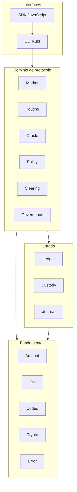
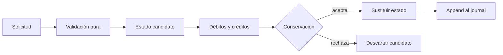
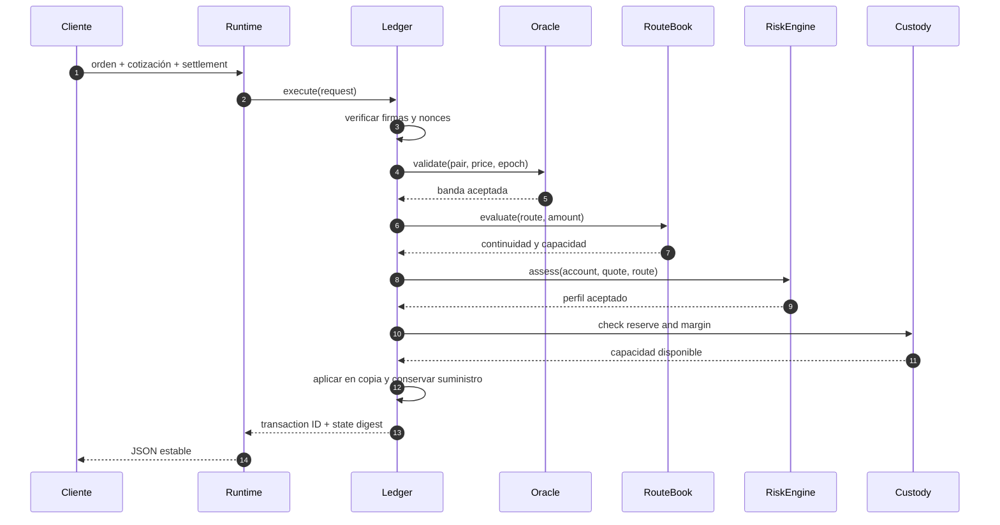

# Arquitectura de AxisDTL

## Propósito

AxisDTL organiza una liquidación RFQ multi-activo como una secuencia
determinista de validación, ejecución contable y registro. La arquitectura evita
que una capa tenga que confiar en una representación producida por otra: cada
límite se comprueba donde se consume y los identificadores se derivan de
payloads canónicos.

El crate expone una librería reutilizable y un binario delgado. `src/lib.rs`
publica los dominios; `src/main.rs` solo traduce argumentos, ejecuta el runtime y
propaga un código de salida.

## Vista de contenedores



## Capas y dependencias

### Fundamentos

`amount` contiene `Amount` y `Bps`. Toda operación que puede desbordar devuelve
un `AxisResult`; no se permiten importes con signo ni conversiones silenciosas.
`ids` define identificadores de 32 bytes y derivación estable. `codec` serializa
payloads, mientras `crypto` encapsula Ed25519 y la correspondencia entre clave
pública y cuenta.

La capa de fundamentos no conoce las reglas de mercado. Esto permite revisar la
aritmética y la autenticación sin introducir dependencias circulares.

### Mercado

`market` representa:

- `AssetConfig`: identificador, símbolo, decimales y escala;
- `ExecutionQuote`: par, precio racional, comisión, nonce, vigencia y ruta;
- `SwapOrder`: intención firmada por el pagador;
- `SettlementRequest`: autorización del solver para una cotización concreta.

Las estructuras firmadas incluyen los campos que influyen en el resultado. El
ledger no acepta identificadores suministrados por el cliente cuando puede
derivarlos del contenido.

### Oráculo y rutas

El registro de oráculos administra publicadores y observaciones por par. La
evaluación de una cotización comprueba que la observación sea reciente y que el
precio permanezca dentro de la banda configurada.

El route book contiene venues y planes. Cada plan es una cadena de tramos
continua: el destino del tramo `n` debe ser la fuente del tramo `n+1`. La
capacidad y el número de tramos se verifican antes de tocar el estado contable.

### Riesgo y custodia

`policy` compone límites globales con perfiles de cuenta. `custody` diferencia
vaults, reservas de tesorería y margen. La separación evita que una cifra de
liquidez operativa sea interpretada como colateral o como reserva protegida.

### Ledger

El ledger es el único propietario de balances confirmados, nonces consumidos,
suministro esperado y journal. La ejecución sigue este patrón:



### Compensación

`clearing` recibe obligaciones ya identificadas para una ventana y calcula
posiciones por `(cuenta, activo)`. El resultado es una vista previa: no mueve
saldos. Expone el importe bruto, el pago neto, el ahorro por compresión, la
reserva exigida y el déficit por activo.

La salida se ordena con `BTreeMap` y `BTreeSet`. Dos nodos con las mismas
entradas producen el mismo orden y el mismo digest BLAKE3.

### Gobierno

`governance` administra acciones de control firmadas. Las propuestas, votos,
aprobaciones, cancelaciones y ejecuciones mantienen conjuntos separados. El
comité no modifica directamente otro módulo: devuelve una acción ejecutable que
la capa de orquestación debe aplicar de manera explícita.

## Pipeline de una orden



## Determinismo

AxisDTL usa cuatro reglas para que una ejecución pueda reproducirse:

1. Las colecciones que forman parte de un digest tienen orden total.
2. Los payloads se serializan con una versión y un dominio.
3. Los importes permanecen como enteros en unidades mínimas.
4. Los escenarios usan fixtures y epochs explícitos.

El digest de un ciclo de compensación incluye:

```text
domain = "axis-clearing-cycle-v1"
payload = {
  version,
  window,
  obligation_count,
  ordered_positions,
  ordered_asset_summaries
}
```

Un cambio de orden, posición o reserva produce un digest diferente.

## Modelo de errores

Los dominios devuelven `AxisError` en lugar de activar `panic!` ante entradas
externas. Las categorías distinguen importe, política, firma, saldo, ruta,
oráculo y serialización. Los mensajes aportan contexto operativo sin incluir
claves ni material secreto.

## Extensión segura

Para incorporar un nuevo tipo de acción o venue:

1. Definir el payload en el módulo propietario.
2. Incluir todos los campos económicos en la representación canónica.
3. Asignar un dominio versionado cuando exista firma o digest.
4. Validar límites antes de mutar estado.
5. Añadir tests de aceptación, rechazo y repetición.
6. Verificar conservación y estabilidad del JSON.
7. Documentar el cambio de interfaz y su procedimiento operativo.

## Mapa del repositorio

```text
assets/                 identidad visual
docs/                   documentación operativa y de diseño
sdk/                    cliente y utilidades JavaScript
scripts/                puertas de verificación
src/amount/             aritmética comprobada
src/clearing/           netting y reservas por ventana
src/codec/              codificación canónica
src/crypto/             identidad y firmas
src/custody/            vaults, tesorería y margen
src/governance/         comité y acciones de control
src/ledger/             balances, estado y journal
src/market/             activos, RFQ y settlement
src/oracle/             feeds y publicadores
src/policy/             límites y perfiles
src/routing/            venues y rutas
src/runtime/            escenarios y salida JSON
tests/                  pruebas Rust y de compatibilidad
```

## Decisiones de diseño

- **Enteros sobre coma flotante:** evita resultados dependientes de plataforma.
- **Estado candidato sobre rollback manual:** reduce caminos de error parcial.
- **Dominios separados:** impide reutilizar una firma entre tipos de mensaje.
- **Vista previa de netting:** permite reservar liquidez antes de confirmar.
- **Biblioteca más binario delgado:** simplifica tests e integraciones nativas.
- **Salida JSON:** desacopla el motor Rust de automatizaciones JavaScript.
