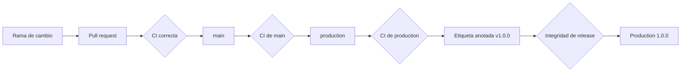
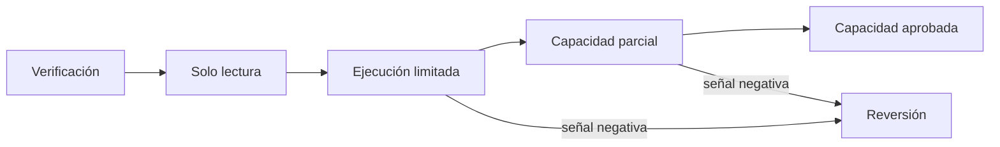

# Despliegue

## Estrategia

AxisDTL se distribuye como binario Rust reproducible junto con su documentación
y SDK. La promoción usa una rama `production`, una etiqueta anotada y una
release de GitHub que apuntan al mismo commit verificado.



## Preparación del entorno

Fijar las herramientas declaradas:

```bash
rustup toolchain install 1.96 --component rustfmt clippy
bun --version
node --version
```

Instalar dependencias desde lockfiles:

```bash
cargo fetch --locked
bun install --frozen-lockfile
```

No actualizar dependencias durante una construcción de release.

## Construcción

```bash
cargo build --release --locked
```

Artefacto principal:

```text
target/release/axis_dtl
target/release/axis_dtl.exe
```

Registrar SHA-256:

```bash
sha256sum target/release/axis_dtl
```

PowerShell:

```powershell
Get-FileHash -Algorithm SHA256 .\target\release\axis_dtl.exe
```

## Puertas previas

```bash
bash scripts/ci.sh
```

La puerta debe comprobar:

- formato Rust y Prettier;
- build de todos los targets con lockfile;
- tests unitarios, integración y compatibilidad;
- Clippy con advertencias denegadas;
- sintaxis JavaScript;
- estructura documental y banner;
- versiones de manifiestos.

No se publica desde un worktree con cambios sin registrar.

## Configuración

Los escenarios actuales generan su configuración de manera determinista. Una
integración que cargue configuración externa debe fijar:

- network ID;
- catálogo y decimales de activos;
- identidades de pagadores, solvers y publicadores;
- límites de riesgo;
- venues, rutas, capacidades y floors;
- vaults, reservas y margen;
- revisores, quórum y nonces;
- epoch y ventanas operativas.

El archivo se serializa canónicamente y se registra su digest. Los secretos se
inyectan desde el gestor del entorno, nunca desde el archivo.

## Variables y secretos

El motor base no requiere variables de entorno. Si un adaptador incorpora
claves o endpoints:

- usar nombres específicos del servicio;
- limitar lectura al proceso necesario;
- rotar credenciales por entorno;
- evitar argumentos de línea de comandos para secretos;
- redactar stdout y stderr;
- no copiar secretos a artefactos o contenedores.

## Promoción

Secuencia de referencia tras fusionar el pull request:

```bash
git fetch origin
git switch main
git pull --ff-only origin main
git push origin main:production
git tag -a v1.0.0 -m "Production 1.0.0"
git push origin v1.0.0
```

Antes de crear la release:

```bash
git fetch origin main production --tags
test "$(git rev-parse origin/main)" = "$(git rev-parse origin/production)"
test "$(git rev-parse origin/main)" = "$(git rev-parse 'v1.0.0^{}')"
test "$(git cat-file -t refs/tags/v1.0.0)" = "tag"
```

El workflow `release-integrity.yml` reproduce estas condiciones y compara la
versión de la etiqueta con `Cargo.toml` y `package.json`.

## Estrategia de rollout

Para una integración persistente:

1. desplegar en entorno de verificación;
2. ejecutar `snapshot`, `direct` y `routed`;
3. confirmar digests y conservación;
4. habilitar tráfico de lectura;
5. habilitar un porcentaje limitado de ejecución;
6. observar nonces, reservas, capacidad y rechazos;
7. ampliar solo con señales estables.



## Health check

El SDK deriva una vista compacta desde `snapshot`:

```js
const health = await client.health();

assert.equal(health.conserved, true);
assert.match(health.stateDigest, /^[0-9a-f]{64}$/);
assert.ok(health.surface.venues >= 1);
assert.ok(health.surface.vaults >= 1);
```

Una respuesta HTTP del adaptador no se considera suficiente si
`conserved !== true`.

## Reversión

La reversión usa una versión previamente verificada y conserva el estado:

1. detener admisión;
2. capturar snapshot y journal;
3. comprobar compatibilidad del formato de estado;
4. desplegar el binario anterior por su SHA-256;
5. reproducir snapshot;
6. comparar suministro, nonces y digest;
7. reanudar de forma gradual.

No mover `production` ni una etiqueta existente para simular una reversión. Se
publica una nueva versión que documenta el cambio.

## Matriz de comprobación

| Fase       | Evidencia          | Condición de salida              |
| ---------- | ------------------ | -------------------------------- |
| Build      | binario + SHA-256  | compilación bloqueada            |
| Test       | log de CI          | todas las suites correctas       |
| Main       | commit remoto      | CI correcta                      |
| Production | commit remoto      | igual a main                     |
| Tag        | objeto Git anotado | resuelve al commit de production |
| Release    | entrada GitHub     | no draft, no prerelease          |
| Smoke      | snapshot y routed  | conservación verdadera           |

## Post-despliegue

- [ ] Commit, etiqueta y SHA-256 registrados.
- [ ] `main` y `production` coinciden.
- [ ] Workflows de CI e integridad correctos.
- [ ] Snapshot inicial archivado.
- [ ] Conservación verdadera para todos los activos.
- [ ] Publicadores, rutas, vaults y margen presentes.
- [ ] Nonces iniciales confirmados.
- [ ] Reserva sin déficit.
- [ ] Alertas y procedimiento de reversión disponibles.
