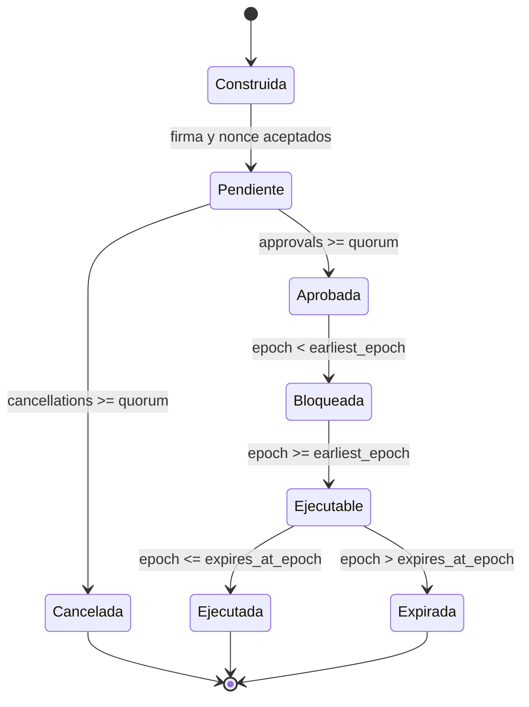
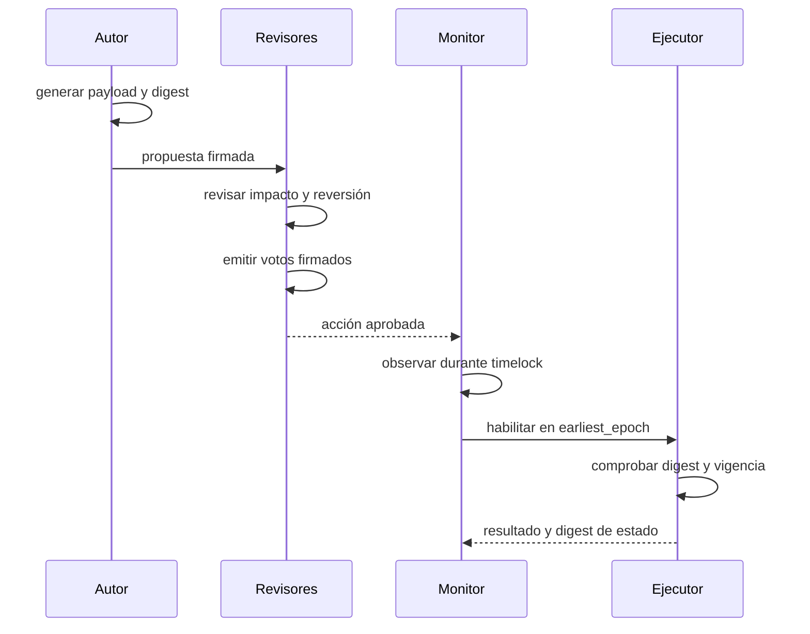

# Gobierno del protocolo

## Alcance

El gobierno de AxisDTL coordina cambios sensibles sin conceder autoridad
unilateral. El módulo `governance` implementa propuestas y votos firmados,
quórum, cancelación, timelock, expiración y protección contra repetición.

Las acciones autorizables son:

| Tipo              | Uso esperado                                     |
| ----------------- | ------------------------------------------------ |
| `AssetPolicy`     | alta o ajuste de metadatos operativos de activos |
| `OracleCommittee` | rotación de publicadores y política de feeds     |
| `RoutePolicy`     | venues, capacidad y límites de rutas             |
| `RiskLimits`      | perfiles, importes, comisiones y exposición      |
| `TreasuryPolicy`  | reserva, vaults y asignación de tesorería        |
| `EmergencyPause`  | contención temporal de operaciones               |

## Roles

- **Proponente:** revisor registrado que firma una acción.
- **Revisor:** identidad Ed25519 con capacidad de aprobar o cancelar.
- **Ejecutor:** proceso que solicita materializar una acción aprobada.
- **Operador:** aplica la acción devuelta al dominio correspondiente y registra
  el resultado.

Proponer cuenta como el primer voto de aprobación. El ejecutor no obtiene
derechos de voto y no puede cambiar el payload.

## Ciclo de vida



El digest de la acción es su identificador. Se rechaza si ya aparece en
pendientes, aprobadas o ejecutadas.

## Payload de propuesta

Una `ControlAction` contiene:

```text
kind
payload_digest
proposer
proposal_nonce
earliest_epoch
expires_at_epoch
```

`payload_digest` referencia el documento o configuración exacta que se aplicará.
Los operadores deben conservar ese documento y comprobar su digest antes de
ejecutarlo.

La ventana exige:

```text
earliest_epoch < expires_at_epoch
```

No se aceptan ventanas vacías ni invertidas.

## Votos

Un voto contiene digest, revisor, nonce y decisión. Las decisiones posibles son
`Approve` y `Cancel`; se acumulan de forma independiente.

Reglas:

1. El revisor debe estar registrado.
2. La identidad debe coincidir con la clave firmante.
3. El nonce debe ser el siguiente esperado.
4. El digest debe identificar una acción pendiente.
5. Una identidad solo puede votar una vez sobre esa acción.
6. Alcanzar quórum de cancelación elimina la acción pendiente.

## Timelock

El timelock crea una ventana de observación entre aprobación y ejecución. Su
duración debe ser proporcional al alcance:

| Clase         | Ejemplo                     | Demora recomendada |
| ------------- | --------------------------- | -----------------: |
| Operativa     | ajuste menor de capacidad   |          1 ventana |
| Económica     | límites o buffer de reserva |         2 ventanas |
| Criptográfica | rotación de comité          |         3 ventanas |
| Emergencia    | pausa restrictiva           | mínima documentada |

Estas cifras son una política operativa; el módulo solo aplica los epochs
incluidos en la propuesta firmada.

## Gestión del comité

El quórum debe ser positivo y no puede superar el número de revisores. Una
retirada se rechaza cuando:

- el revisor no existe;
- el conjunto restante no alcanza el quórum configurado;
- el revisor mantiene una aprobación o cancelación sobre una acción pendiente.

La rotación recomendada es:

1. registrar la nueva identidad;
2. confirmar acceso y nonce inicial;
3. ajustar quórum si procede;
4. resolver acciones pendientes del revisor saliente;
5. retirar la identidad anterior;
6. archivar evidencia y actualizar runbook.

## Ceremonia de cambio



La revisión previa debe incluir:

- motivo y alcance exacto;
- valores anteriores y posteriores;
- estimación de impacto en capacidad y reserva;
- dependencias de oráculo, ruta y custodia;
- criterio de éxito;
- condición y procedimiento de reversión.

## Acciones de emergencia

`EmergencyPause` debe reducir autoridad o capacidad; no se utiliza para
transferir saldos. La propuesta debe especificar dominio afectado, duración y
condición de reanudación.

Una pausa no reemplaza la reconciliación. El operador conserva journal,
balances, nonces y digests, y verifica el estado antes de reanudar.

## Auditoría de gobierno

Por cada acción conservar:

- payload original y su digest;
- identidad y nonce del proponente;
- firmas, decisiones y nonces de revisores;
- quórum vigente;
- epochs de inicio y expiración;
- resultado de ejecución o cancelación;
- digest de estado previo y posterior;
- referencia de la versión que contiene el cambio.

## Fallos operativos esperados

| Condición                  | Resultado                     |
| -------------------------- | ----------------------------- |
| firma alterada             | rechazo de propuesta o voto   |
| nonce repetido             | rechazo sin cambio confirmado |
| segundo voto de un revisor | rechazo                       |
| quórum incompleto          | permanece pendiente           |
| ejecución temprana         | rechazo por timelock          |
| ejecución tardía           | rechazo por expiración        |
| digest ya ejecutado        | rechazo de repetición         |
| retirada que rompe quórum  | rechazo                       |

## Checklist del operador

- [ ] El payload aplicado coincide con `payload_digest`.
- [ ] Todas las firmas pertenecen a revisores activos.
- [ ] Los nonces coinciden con el estado confirmado.
- [ ] El quórum se alcanzó con identidades únicas.
- [ ] El epoch está dentro de la ventana.
- [ ] El plan de reversión está disponible.
- [ ] Los monitores económicos están activos.
- [ ] El resultado y el digest final quedan registrados.
