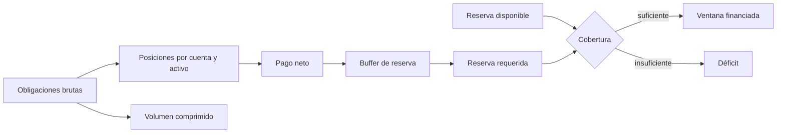

# Modelo económico

## Objetivo

El modelo económico de AxisDTL relaciona ejecución RFQ, liquidez de rutas,
comisiones, reservas y compensación multilateral. Todas las magnitudes se
representan en unidades mínimas enteras y cada activo conserva su propia
precisión.

El sistema diferencia tres conceptos que no deben mezclarse:

- **saldo:** propiedad contable de una cuenta;
- **capacidad:** volumen que una ruta puede procesar;
- **reserva:** liquidez protegida para cubrir pagos netos y contingencias.

## Unidades y basis points

Para un activo con `d` decimales:

```text
scale(d) = 10^d
displayAmount = minimalUnits / scale(d)
```

Los límites porcentuales se expresan en basis points:

```text
1 bp      = 0,01 %
100 bps   = 1 %
10.000 bps = 100 %
```

El SDK aplica:

```text
applyBps(value, bps) = floor(value × bps / 10.000)
```

El truncado siempre favorece no crear unidades fraccionarias inexistentes. Las
políticas que necesiten un mínimo conservador deben incorporar el margen en el
parámetro, no mediante coma flotante.

## Formación de precio

Una cotización representa el precio como una fracción `price_num / price_den`.
Esto evita floats y permite revisar numerador, denominador y vigencia por
separado.

La orden vincula:

- activo fuente y destino;
- importe fuente;
- salida mínima;
- pagador y receptor;
- cotización elegida;
- nonce y expiración.

La comisión del solver se calcula sobre la salida de ejecución:

```text
solverFee = floor(outputAmount × feeBps / 10.000)
receiverAmount = outputAmount - solverFee
```

La política limita `feeBps` y la orden protege al receptor con
`minimum_output`. Una ejecución se rechaza si la salida neta no satisface la
condición firmada.

## Liquidez de rutas

Cada venue publica una capacidad y puede reservar un floor no utilizable. Para
una ruta:

```text
effectiveLimit = max(configuredLimit - reserveFloor, 0)
remaining      = max(effectiveLimit - usedCapacity, 0)
accepted       = requestedAmount <= remaining
```

La utilización operativa se presenta como:

```text
utilizationBps = min(floor(projectedUse × 10.000 / effectiveLimit), 10.000)
```

Si `effectiveLimit = 0`, se informa `10.000` bps para reflejar que no existe
capacidad disponible.

## Compensación multilateral

### Obligaciones

Una obligación contiene deudor, acreedor, activo, importe, ventana y referencia
única. El motor agrupa por `(cuenta, activo)`:

```text
grossDebit(i,a)  = Σ amount(o) donde debtor(o)=i y asset(o)=a
grossCredit(i,a) = Σ amount(o) donde creditor(o)=i y asset(o)=a
```

La posición neta es unilateral:

```text
netDebit(i,a)  = max(grossDebit(i,a) - grossCredit(i,a), 0)
netCredit(i,a) = max(grossCredit(i,a) - grossDebit(i,a), 0)
```

Una cuenta nunca presenta débito neto y crédito neto positivos para el mismo
activo.

### Balance por activo

Para cada activo:

```text
Σ netDebit(i,a) = Σ netCredit(i,a)
```

Esta igualdad es una puerta estructural. Un activo no puede compensar un
desequilibrio de otro y dos ventanas no se mezclan en el mismo ciclo.

### Compresión

```text
grossObligations(a) = Σ amount(o) para asset(o)=a
netPayable(a)       = Σ netDebit(i,a)
compressed(a)       = grossObligations(a) - netPayable(a)
compressionBps(a)  = floor(compressed(a) × 10.000 / grossObligations(a))
```

La compresión expresa volumen que no necesita cruzar la capa de pago final. No
representa ingreso, quema ni descuento para un participante.

## Ejemplo de ciclo

Tres participantes mantienen estas obligaciones en AXUSD:

| Deudor | Acreedor | Importe |
| ------ | -------- | ------: |
| Alpha  | Beta     |     100 |
| Beta   | Gamma    |      70 |
| Gamma  | Alpha    |      40 |

Posiciones resultantes:

| Cuenta | Débito bruto | Crédito bruto | Débito neto | Crédito neto |
| ------ | -----------: | ------------: | ----------: | -----------: |
| Alpha  |          100 |            40 |          60 |            0 |
| Beta   |           70 |           100 |           0 |           30 |
| Gamma  |           40 |            70 |           0 |           30 |

```text
grossObligations = 210
netPayable       = 60
compressed       = 150
compressionBps   = floor(150 × 10.000 / 210) = 7.142
```

El ciclo reduce el volumen de pago un `71,42 %` sin alterar el crédito neto de
ninguna cuenta.

## Reserva y buffer

La reserva exigida sobre el pago neto es:

```text
requiredReserve = floor(netPayable × (10.000 + bufferBps) / 10.000)
shortfall       = max(requiredReserve - availableReserve, 0)
```

Con `netPayable = 60` y `bufferBps = 1.000`:

```text
requiredReserve = floor(60 × 11.000 / 10.000) = 66
```

| Reserva disponible | Estado       | Déficit |
| -----------------: | ------------ | ------: |
|                 70 | financiado   |       0 |
|                 66 | financiado   |       0 |
|                 65 | insuficiente |       1 |

El campo `fully_reserved` solo es verdadero cuando todos los activos del ciclo
tienen déficit cero.

## Diagrama de flujos económicos



## Parámetros operativos

| Parámetro                | Finalidad                     | Restricción    |
| ------------------------ | ----------------------------- | -------------- |
| `max_obligations`        | limita trabajo por ciclo      | mayor que cero |
| `max_accounts_per_asset` | acota cardinalidad            | al menos dos   |
| `reserve_buffer_bps`     | absorbe variación operativa   | `0..10.000`    |
| `max_fee_bps`            | limita comisión de solver     | `0..10.000`    |
| `max_hops`               | limita complejidad de ruta    | según política |
| `reserve_floor`          | protege liquidez no enrutable | no negativo    |

Los cambios deben entrar mediante gobierno y documentar su motivo, alcance,
epoch de activación y plan de reversión.

## Riesgos operativos y mitigaciones

| Riesgo                 | Señal                            | Respuesta                        |
| ---------------------- | -------------------------------- | -------------------------------- |
| concentración de pagos | neto dominado por una cuenta     | reducir límite y ampliar reserva |
| baja compresión        | bruto cercano al neto            | revisar ventanas y participantes |
| reserva insuficiente   | `shortfall > 0`                  | no confirmar y reponer liquidez  |
| capacidad saturada     | utilización cercana a 10.000 bps | derivar a otra ruta              |
| precio fuera de banda  | rechazo del oráculo              | renovar observación y cotización |
| comisión atípica       | `feeBps` cerca del máximo        | revisión de solver y política    |

## Reconciliación

Por cada ventana se deben conservar:

1. digest del conjunto ordenado de obligaciones;
2. posiciones brutas y netas por cuenta y activo;
3. resumen de reserva disponible y exigida;
4. parámetros de buffer aplicados;
5. resultado de conservación del ledger;
6. digest de estado antes y después de la confirmación.

Una reconciliación correcta reproduce el mismo digest a partir de las mismas
entradas y explica toda diferencia de saldo mediante entradas del journal.
