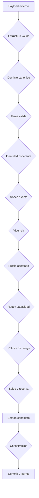
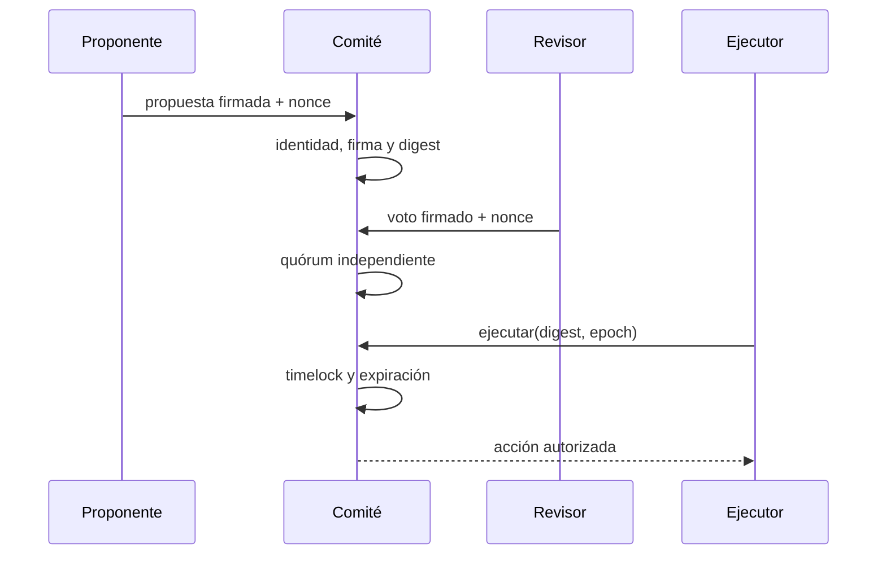

# Modelo de seguridad

## Resumen

AxisDTL utiliza defensa en profundidad: una solicitud debe superar identidad,
integridad, secuencia, tiempo, precio, ruta, riesgo, custodia y contabilidad. Una
puerta aceptada no sustituye a las demás.

El objetivo principal es que solo una intención autorizada y económicamente
admisible pueda transformar el ledger, y que la transformación sea atómica,
reproducible y reconciliable.

## Principios

1. **Autenticidad:** toda intención privilegiada está firmada.
2. **Vinculación:** la firma cubre los campos que determinan el resultado.
3. **Unicidad:** nonces y digests impiden reutilización.
4. **Mínimo privilegio:** roles y dominios no se intercambian.
5. **Atomicidad:** el estado solo cambia tras validar la operación completa.
6. **Conservación:** ningún movimiento crea o destruye suministro.
7. **Determinismo:** una entrada ordenada produce un resultado verificable.
8. **Demora de control:** los cambios sensibles respetan quórum y timelock.

## Matriz de actores

| Actor             | Autoridad                          | No puede hacer por sí solo               |
| ----------------- | ---------------------------------- | ---------------------------------------- |
| Pagador           | firmar su orden y nonce            | autorizar al solver o cambiar riesgo     |
| Solver            | firmar settlement y cotización     | debitar sin orden del pagador            |
| Publicador        | publicar precio de pares asignados | mover balances                           |
| Operador de vault | gestionar capacidad autorizada     | alterar suministro                       |
| Revisor           | proponer y votar control           | ejecutar sin quórum o antes del timelock |
| Runtime           | orquestar dominios                 | eludir invariantes del ledger            |

## Cadena de validación



Un rechazo finaliza el flujo. Los mensajes de error no deben incluir semilla,
clave privada, token o contenido de memoria no necesario.

## Firmas y codificación

La firma Ed25519 se calcula sobre bytes canónicos asociados a un dominio. Dos
estructuras con la misma apariencia textual no se consideran equivalentes si
producen bytes diferentes.

Requisitos para modificar un payload firmado:

- mantener orden y tipo de campos;
- versionar el dominio si cambia la semántica;
- incorporar los nuevos campos económicos;
- añadir un test donde cualquier alteración invalide la firma;
- confirmar que firmas de un dominio se rechazan en los demás.

La relación entre cuenta y clave pública se valida antes de aceptar la firma. No
se confía en un `AccountId` adjunto sin esa comprobación.

## Nonces y estado temporal

Los nonces son contadores estrictos:

```text
received == expected
next = expected + 1
```

El consumo debe quedar incluido en la misma transacción atómica que la acción.
Un rechazo no consume el nonce confirmado; una aceptación no permite volver al
valor anterior.

Las cotizaciones y acciones de gobierno incluyen ventanas temporales. Se
rechazan timestamps anteriores al inicio, posteriores a la expiración o
inconsistentes con la ventana de liquidación.

## Integridad económica

### Aritmética

- `Amount` utiliza `u128` y operaciones comprobadas.
- `Bps` limita el rango a `0..10.000`.
- Los denominadores deben ser distintos de cero.
- Las conversiones de tamaño retornan error si pierden rango.
- El SDK rechaza `number` no seguro y cadenas con signo o formato ambiguo.

### Conservación y atomicidad

El ledger compara el suministro esperado con la suma de cuentas por activo. Los
movimientos se construyen sobre un clon candidato y solo se confirman tras la
igualdad. Esta estrategia cubre errores tardíos de ruta, fee, saldo y journal.

### Separación de activos

Balances, observaciones, reservas, posiciones y resúmenes usan `AssetId` como
parte de la clave. El netting de AXUSD no puede cubrir un déficit de AXEUR.

## Oráculos

Una observación se considera utilizable solo cuando:

1. el publicador pertenece al registro;
2. el par coincide con la cotización;
3. su epoch está dentro de la antigüedad máxima;
4. numerador y denominador forman un precio válido;
5. la desviación está dentro de la política.

La banda limita ejecuciones alejadas del precio de referencia, pero no concede
autoridad para mover fondos. Siguen siendo necesarias orden, settlement y todas
las comprobaciones contables.

## Rutas y capacidad

La validación de una ruta verifica continuidad de activos y pertenencia de cada
venue al libro activo. La capacidad consumida no puede invadir el floor de
reserva. Los cambios de capacidad requieren una acción de control trazable.

Una ruta de varios tramos introduce dependencia en todos sus venues; si uno no
acepta el volumen, se rechaza la ruta completa.

## Compensación

El ciclo de netting impone:

- ventana positiva y uniforme;
- al menos una obligación;
- límite de obligaciones y cuentas por activo;
- partes distintas e importe positivo;
- referencia única;
- igualdad de débitos y créditos netos;
- reserva suficiente antes de confirmar pagos.

El digest incluye posiciones y resúmenes ya ordenados. Una modificación en una
reserva o en una sola obligación cambia el resultado.

## Gobierno

Las propuestas y votos usan firmas y nonces independientes. Dos conjuntos
separados acumulan aprobaciones y cancelaciones. La ejecución requiere que el
digest siga pendiente, haya alcanzado quórum y esté dentro de su ventana.



## Superficie del SDK

El SDK es una ayuda de integración, no una frontera de autoridad. Las entradas
se vuelven a validar en Rust. Aun así, el SDK reduce errores comunes:

- usa `bigint` para importes;
- valida digests hexadecimales de 32 bytes;
- rechaza enteros inseguros;
- calcula reserva y compresión con enteros;
- separa posiciones por cuenta y activo;
- comprueba referencias duplicadas.

## Registro y observabilidad

El journal debe permitir reconstruir:

- transacción y orden relacionadas;
- identidades participantes;
- activos y movimientos;
- nonce consumido;
- ruta seleccionada;
- digest anterior y posterior;
- resultado de conservación.

Los logs de operador deben registrar IDs y digests, no material secreto. Un
digest permite correlación sin copiar el payload completo.

## Lista de revisión

- [ ] Nuevos campos económicos forman parte de firmas y digests.
- [ ] Los errores aritméticos se propagan como `AxisResult`.
- [ ] Los nonces se consumen solo con la transacción confirmada.
- [ ] Los tests cubren alteración de firma y repetición.
- [ ] La operación conserva suministro por activo.
- [ ] El rechazo deja el estado sin cambios.
- [ ] Las rutas preservan continuidad y floors de reserva.
- [ ] El gobierno respeta quórum, timelock y expiración.
- [ ] Los logs no revelan secretos.
- [ ] La puerta local y los workflows finalizan correctamente.

## Supuestos externos

La seguridad del proceso depende de que el host proteja claves privadas, que el
reloj operativo sea monotónico y que la distribución del binario corresponda a
la etiqueta verificada. La rotación de claves, el acceso al host y la copia del
journal deben operar con controles de infraestructura adicionales.
