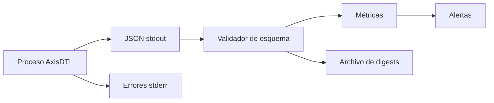
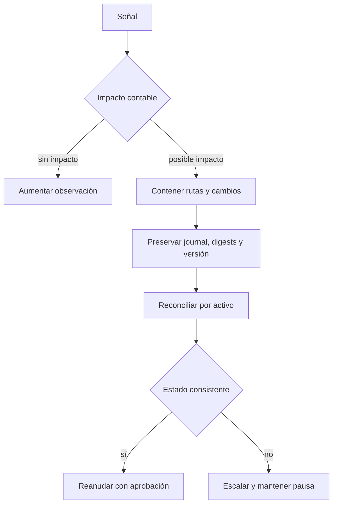

# Operaciones

## Objetivo operativo

Este runbook describe cómo iniciar, observar, reconciliar y detener AxisDTL. Los
escenarios son deterministas y producen JSON por stdout; los errores se envían
por stderr y terminan con un código distinto de cero.

## Requisitos de entorno

| Dependencia | Versión          | Uso                              |
| ----------- | ---------------- | -------------------------------- |
| Rust        | `>= 1.96`        | motor, tests y lint              |
| Bun         | `1.3.14`         | SDK, formato y tests JS          |
| Node.js     | `24`             | comprobación de scripts          |
| Git         | actual mantenida | control de versiones y etiquetas |

Antes de operar una versión, comprobar:

```bash
git status --short
git rev-parse HEAD
git rev-parse origin/main
git rev-parse origin/production
git rev-parse 'v1.0.0^{}'
```

Los tres últimos commits deben coincidir para la versión de producción.

## Arranque

1. Instalar dependencias bloqueadas.
2. Ejecutar la puerta de verificación.
3. Obtener un snapshot inicial.
4. Comprobar conservación y guardar el digest.

```bash
bun install --frozen-lockfile
cargo build --release --locked
bash scripts/ci.sh
./target/release/axis_dtl snapshot > snapshot.json
```

Campos mínimos del snapshot:

| Campo             | Condición                        |
| ----------------- | -------------------------------- |
| `network_id`      | coincide con el entorno esperado |
| `conservation_ok` | `true`                           |
| `state_digest`    | 64 caracteres hexadecimales      |
| `journal_entries` | entero no negativo               |
| `surface.venues`  | al menos un venue para ejecutar  |
| `surface.vaults`  | al menos un vault configurado    |

## Modos de escenario

| Escenario  | Propósito                | Señal esperada                 |
| ---------- | ------------------------ | ------------------------------ |
| `snapshot` | inspección sin órdenes   | listas de transacciones vacías |
| `direct`   | settlement de un tramo   | una orden y una transacción    |
| `routed`   | ruta registrada          | ruta y venue visibles          |
| `batch`    | dos órdenes secuenciales | IDs únicos y conservación      |
| `auction`  | ruta compuesta           | varios tramos continuos        |

Ejecutar un smoke test:

```bash
cargo run --quiet -- snapshot
cargo run --quiet -- routed
```

## Observabilidad



Métricas recomendadas:

- operaciones aceptadas y rechazadas por motivo;
- nonces esperados frente a recibidos;
- antigüedad de observación de precio;
- desviación en basis points;
- utilización por venue;
- pagos bruto y neto por activo;
- compresión por ventana;
- reserva requerida, disponible y déficit;
- entradas de journal y cambios de digest;
- propuestas pendientes y tiempo hasta ejecución o expiración.

Nunca etiquetar una métrica con una clave privada, firma completa o payload
firmado. Para correlación se utilizan IDs y digests.

## Umbrales sugeridos

| Señal                        |          Advertencia |        Acción inmediata |
| ---------------------------- | -------------------: | ----------------------: |
| utilización de ruta          |       `>= 8.000 bps` |          `>= 9.500 bps` |
| reserva disponible/requerida |             `< 1,20` |                `< 1,00` |
| observación de precio        |     `>= 70 %` de TTL |                expirada |
| error de conservación        |                  n/a | cualquier valor `false` |
| nonce inesperado             | incremento sostenido |   repetición coordinada |
| acción por expirar           |       `< 2 ventanas` |           `< 1 ventana` |

Los valores definitivos deben ajustarse al entorno y aprobarse mediante el
proceso de gobierno.

## Reconciliación diaria

1. Capturar snapshot al inicio y al final del periodo.
2. Enumerar transacciones y entradas de journal.
3. Sumar balances por activo.
4. Comparar con suministro esperado.
5. Reproducir digests de ventanas de compensación.
6. Confirmar cobertura de reserva.
7. Registrar cualquier rechazo y su causa.

```text
opening_balance
+ credits
- debits
= closing_balance

Σ closing_balance(account, asset) = expected_supply(asset)
```

Una diferencia no se corrige manualmente. Se detienen nuevas confirmaciones, se
preservan los artefactos y se reproduce la secuencia desde el último digest
confirmado.

## Respuesta a incidentes



Orden de contención:

1. detener nuevas entradas en la interfaz externa;
2. impedir cambios de configuración no relacionados;
3. capturar commit, versión, hora, journal y digests;
4. identificar activos, rutas y cuentas afectados;
5. ejecutar reconciliación sin modificar el estado original;
6. preparar una acción de gobierno con reversión documentada;
7. reanudar solo tras validar conservación y reservas.

## Copia y restauración

Los artefactos mínimos de continuidad son:

- binario identificado por SHA-256;
- archivos de bloqueo;
- configuración activa y su digest;
- journal completo;
- snapshot del ledger;
- conjunto de publicadores y revisores;
- nonces confirmados;
- última ventana de compensación.

Una restauración se valida en un entorno aislado. El digest reconstruido debe
coincidir con el snapshot antes de habilitar entrada de operaciones.

## Cierre controlado

1. detener admisión de nuevas órdenes;
2. finalizar o expirar solicitudes en curso;
3. cerrar la ventana de netting;
4. confirmar reserva y conservación;
5. emitir snapshot final;
6. archivar journal y digests;
7. detener el proceso.

No se debe forzar el cierre durante la escritura del journal.

## Verificación posterior

```bash
cargo run --quiet -- snapshot
cargo test --locked
bun test --timeout 30000 ./tests/node ./sdk ./scripts
```

El operador registra versión, commit, resultado, digest inicial, digest final y
motivo del reinicio o cierre.
